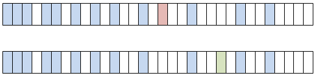
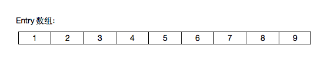
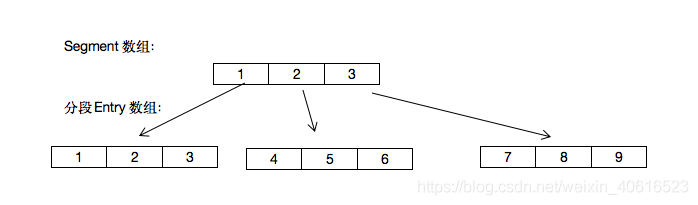
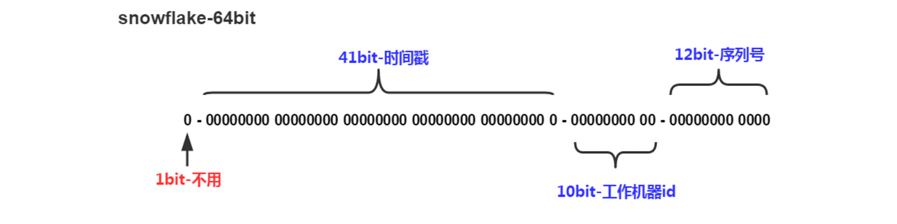

### 在文件中找到非法的字段

正则表达式

### 二进制111011001转化为七进制(111)

```javascript
111011001/111=1000011 	余100，  七进制数4
1000011/111=1001 		余100，  七进制数4
1001/111=1 				余10，   七进制数2
1/111=0 				余1，	   七进制数1
(111011001)2=(1244)7 

在做除法相减的时候 可以先转化成十进制再用二进制表示出来
最后只有当除数变成0的时候结束
最后的结果是倒着表示出来
```

### DNS(域名解析协议)

如果说***ARP协议***是用来将***IP地址***转换为***MAC地址***，那么***DNS协议***则是用来将***域名***转换为***IP地址***（也可以将***IP地址***转换为相应的***域名***地址）。

DNS占用***53号***端口，同时使用***TCP***和***UDP***协议。

DNS在区域传输的时候使用TCP协议，其他时候使用UDP协议。

### log4j 的使用

在spring中添加web.xml 日志就会跟随Spring窗口启动而启动了

 ***Log4J的常见日志及优先级***
Log4j——Log for Java(Java日志)，**控制台**、**文件**、**GUI组件**，也可是**套接口服务器**。
Log4j的日志记录器：
Log4j有八种日志***OFF 、FATAL 、ERROR 、WARN 、INFO 、DEBUG 、TRACE 、ALL*** (由优先级排序)

- OFF: **关闭**所有日志记录，最高等级；
- FATAL: 指出每个**严重的错误**事件将会导致应用程序的退出。这个级别比较高了。重大错误，这种级别你可以直接停止程序了。
- ERROR: 指出虽然发生错误事件，但仍然不影响系统的继续运行。**打印错误和异常信息**，如果不想输出太多的日志，可以使用这个级别。
- WARN: 表明会出现**潜在错误**的情形，有些信息不是错误信息，但是也要给程序员的一些提示。
  I
- NFO: 消息在**粗粒度级别上**突出强调应用程序的运行过程。打印一些你感兴趣的或者重要的信息，这个可以用于生产环境中输出程序运行的一些重要信息，但是不能滥用，避免打印过多的日志。(粒度 也相当于类上面的粒度 方法上面的粒度  语句上的粒度)
- DEBUG: 指出细粒度信息事件对**调试应用程序**是非常有帮助的，主要用于开发过程中打印一些运行信息。
  

### Jedis和RedisTemplate有何区别？

**jedis**是Redis官方推荐的面向**Java的操作Redis的客户端**，而**RedisTemplate**是**SpringDataRedis中对JedisApi的高度封装**。
SpringDataRedis相对于Jedis来说可以方便地更换Redis的Java客户端，比Jedis多了**自动管理连接池**的特性，方便与其他Spring框架进行**搭配使用**如：**SpringCache**


### HashMap扩容机制

##### HashMap的扩容机制---resize()

**什么时候扩容：**当向容器添加元素的时候，会判断当前容器的***元素个数***，如果大于等于阈值---即当前***数组的长度***乘以***加载因子***的值的时候，就要自动扩容啦。

**扩容(resize)**就是重新计算容量，向HashMap对象里不停的添加元素，而HashMap对象内部的数组无法装载更多的元素时，对象就需要扩大数组的长度，以便能装入更多的元素。当然Java里的数组是无法自动扩容的，***方法是使用一个新的数组代替已有的容量小的数组***，就像我们用一个小桶装水，如果想装更多的水，就得换大水桶。

```java
/** 
 * HashMap 添加节点 
 * 
 * @param hash        当前key生成的hashcode 
 * @param key         要添加到 HashMap 的key 
 * @param value       要添加到 HashMap 的value 
 * @param bucketIndex 桶，也就是这个要添加 HashMap 里的这个数据对应到数组的位置下标 
 */  
void addEntry(int hash, K key, V value, int bucketIndex) {  
    //size：The number of key-value mappings contained in this map.  
    //threshold：The next size value at which to resize (capacity * load factor)  
    //数组扩容条件：1.已经存在的key-value mappings的个数大于等于阈值  
    //            2.底层数组的bucketIndex坐标处不等于null  
    if ((size >= threshold) && (null != table[bucketIndex])) {  
        resize(2 * table.length);//扩容之后，数组长度变了  
        hash = (null != key) ? hash(key) : 0;//为什么要再次计算一下hash值呢？  
        bucketIndex = indexFor(hash, table.length);//扩容之后，数组长度变了，在数组的下标跟数组长度有关，得重算。  
    }  
    createEntry(hash, key, value, bucketIndex);  
}  
  
/** 
 * 这地方就是链表出现的地方，有2种情况 
 * 1，原来的桶bucketIndex处是没值的，那么就不会有链表出来啦 
 * 2，原来这地方有值，那么根据Entry的构造函数，把新传进来的key-value mapping放在数组上，原来的就挂在这个新来的next属性上了 
 */  
void createEntry(int hash, K key, V value, int bucketIndex) {  
    HashMap.Entry<K, V> e = table[bucketIndex];  
    table[bucketIndex] = new HashMap.Entry<>(hash, key, value, e);  
    size++;  
}
```

我们分析下resize的源码，鉴于JDK1.8融入了红黑树，较复杂，为了便于理解我们仍然使用JDK1.7的代码，好理解一些，本质上区别不大，具体区别后文再说。

```java
    void resize(int newCapacity) {   //传入新的容量
        Entry[] oldTable = table;    //引用扩容前的Entry数组
        int oldCapacity = oldTable.length;
        if (oldCapacity == MAXIMUM_CAPACITY) {  //扩容前的数组大小如果已经达到最大(2^30)了
            threshold = Integer.MAX_VALUE; //修改阈值为int的最大值(2^31-1)，这样以后就不会扩容了
            return;
        }
 
        Entry[] newTable = new Entry[newCapacity];  //初始化一个新的Entry数组
        transfer(newTable);                         //！！将数据转移到新的Entry数组里
        table = newTable;                           //HashMap的table属性引用新的Entry数组
        threshold = (int) (newCapacity * loadFactor);//修改阈值
    }
```

这里就是使用一个容量更大的数组来代替已有的容量小的数组，transfer()方法将原有Entry数组的元素拷贝到新的Entry数组里。

```java
    void transfer(Entry[] newTable) {
        Entry[] src = table;                   //src引用了旧的Entry数组
        int newCapacity = newTable.length;
        for (int j = 0; j < src.length; j++) { //遍历旧的Entry数组
            Entry<K, V> e = src[j];             //取得旧Entry数组的每个元素
            if (e != null) {
                src[j] = null;//释放旧Entry数组的对象引用（for循环后，旧的Entry数组不再引用任何对象）
                do {
                    Entry<K, V> next = e.next;
                    int i = indexFor(e.hash, newCapacity); //！！重新计算每个元素在数组中的位置
                    e.next = newTable[i]; //标记[1]
                    newTable[i] = e;      //将元素放在数组上
                    e = next;             //访问下一个Entry链上的元素
                } while (e != null);
            }
        }
    }

```

```java
    static int indexFor(int h, int length) {
        return h & (length - 1);
    }
```

newTable[i]的引用赋给了e.next，也就是使用了单链表的头插入方式，同一位置上新元素总会被放在链表的头部位置；这样先放在一个索引上的元素终会被放到Entry链的尾部(**如果发生了hash冲突的话**），这一点和Jdk1.8有区别，下文详解。在旧数组中同一条Entry链上的元素，通过重新计算索引位置后，有可能被放到了新数组的不同位置上。

##### 小结

(1) 扩容是一个***特别耗性能***的操作，所以当程序员在使用HashMap的时候，估算map的大小，初始化的时候给一个大致的数值，避免map进行频繁的扩容。

(2) 负载因子是可以修改的，也可以大于1，但是建议不要轻易修改，除非情况非常特殊。

(3) HashMap是线程不安全的，不要在并发的环境中同时操作HashMap，建议使用**ConcurrentHashMap**。

(4) JDK1.8引入红黑树大程度优化了HashMap的性能。

(5) 还没升级JDK1.8的，现在开始升级吧。HashMap的性能提升仅仅是JDK1.8的冰山一角。


### HashMap线程安全

线程不安全的原因:


在多线程环境下，假设有容器map，其存储的情况如下图所示（淡蓝色为已有数据）。


此时的map已经达到了***扩容阈值12***（16 * 0.75 = 12），而此时线程A与线程B同时对map容器进行插入操作，那么都需要扩容。此时可能出现的情况如下：线程A与线程B***都进行了扩容***，此时便有***两个新的table***，那么再赋值给***原先***的table变量时，便会出现其中一个newTable***会被覆盖***，假如线程B扩容的newTable覆盖了线程A扩容的newTable，并且是在A已经执行了插入操作之后，那么就会出现线程A的***插入失效***问题，也即是如下图中的两个table只能有一个会最后存在，而***其中一个插入的值会被舍弃***的问题。


这便是HashMap的线程不安全性，当然这只是其中的一点。而要消除这种隐患，则可以***加锁***或使用***HashTable和ConcurrentHashMap***这样的线程安全类，但是HashTable不被建议使用，推荐使用ConcurrentHashMap容器。

***那么怎么才能让HashMap变成线程安全的呢？***

可以通过以下三种方法来实现：

- 替换成Hashtable，Hashtable通过对整个表上锁实现线程安全，因此***效率比较低***

  > 在HashTable这个房子中，***只有一个房间***，就像是一个大仓库，里面是一大长列的存放Entry的货架（数组）；只要有一个人进了这个房间，他就会***把这个房间锁起来***，直到这个人在房间里面做完了事情出来之后才会把门打开。此间如果有其他人想要进去，就只能在外面等这个人把房门打开，然后才能进去。这样的话会导致外面等了很多人，效率不高。

- 使用Collections类的synchronizedMap方法包装一下。方法如下：

  public static <K,V> Map<K,V> synchronizedMap(Map<K,V> m)  返回由指定映射支持的同步（线程安全的）映射

- 使用ConcurrentHashMap，它使用分段锁来保证线程安全，效率高，推荐使用

  > 在ConcurrentHashMap这个房子中，有***许多的房间***，每个房间都存着一部分的Entry货架（Entry数组的不同段，将一整个的Entry数组分开了），而这些房间各自又有着***不同的锁***。一个人在访问某一个房间的时候，会把这个房间锁起来，***其他的房间***依然是***可以进去访问的***，这样就大大的提高了效率。
  >
  > 在HashTable中，如果线程A想要访问Entry数组前面位置的元素，线程B想要访问数组尾部的位置的元素，但是A先进房间访问了，那么房子就被锁了，B不得不等待。
  >
  > 在ConcurrentHashMap中，A进到了***前面位置***元素所在的房间访问，B仍然可以去***尾部元素***所在的房间，因为他们处在***不同的房间***。
  >
  > ***分段锁***在我的理解中是***先分段再锁***，将原本的一整个的Entry数组***分成了若干段***，分别将这若干段放在了不同的新的***Segment数组***中（分房间），每个Segment有各自的锁，以此提高效率。

  HashTable：

  

  ConcurrentHashMap：

  

### MySQL的事务并发问题

事务的四个特性: 

A(原子性)、C(一致性)、I(隔离性)、D(持久性)

MySQL提供了4种隔离级别，分别为

- READ UNCOMMITTED - 读未提交，事务内可读到其他事务未提交的修改  发生脏读问题

  ```sql
  SET SESSION TRANSACTION ISOLATION LEVEL READ UNCOMMITTED;
  ```

- READ COMMITTED - 读已提交，事务内可读到其他事务已提交的修改       解决脏读问题

  ```sql
  SET SESSION TRANSACTION ISOLATION LEVEL READ COMMITTED;
  ```

- REPEATABLE READ - 可重复读（默认级别），在一个事务内重复读数据会一直保持一致，在本事务结束后才能读到其他事务的修改

  ```sql
  SET SESSION TRANSACTION ISOLATION LEVEL READ COMMITTED;
  ```

  > SQL中对数据的修改分为更新、插入和删除，分别对应三种不可重复读的问题，后两种问题也被称为“幻读”。

- SERIALIZABLE - 串行化，事务不可以交替修改数据

依次解决了脏读、不可重复读和幻读问题，由上到下的并发控制也越来越严格。而且上述四种隔离级别都不支持脏写（写未提交）（假设还有WRITE UNCOMMITTED级别是不支持的）。那么MySQL是如何实现这几种隔离级别的呢？接下来就需要深入研究一下数据库的封锁技术了。


### 分布式创建ID的方法

- 特性: 

  - 全局唯一 
  - 数字类型 趋势递增
  - 长度短
  - 信息安全
  - 高可用低延迟

- 方法

  - 基于UUID 

    - 优点
      - 代码实现足够简单易用。
      - 本地生成没有性能问题。
      - 因为具备全球唯一的特性，所以对于数据库迁移这种情况不存在问题。
    - 缺点
      - 每次生成的ID都是无序的，而且不是全数字，且无法保证趋势递增。
      - UUID生成的是字符串，字符串存储性能差，查询效率慢。
      - UUID长度过长，不适用于存储，耗费数据库性能。
      - ID无一定业务含义，可读性差。
    - 适用场景
      - 可以用来生成如token令牌一类的场景，足够没辨识度，而且无序可读，长度足够。
      - 可以用于无纯数字要求、无序自增、无可读性要求的场景。

  - 基于推特的Snowflake算法 使用IdWork

    - 

    - 缺点

      - **强依赖于机器时钟**，如果时钟回拨，会导致重复的ID生成，所以一般基于此的算法发现时钟回拨，都会抛异常处理，阻止ID生成，这可能导致服务不可用。

    - 适用场景

      雪花算法有很明显的缺点就是时钟依赖，如果确保机器不存在时钟回拨情况的话，那使用这种方式生成分布式ID是可行的，当然小规模系统完全是能够使用的

  - 基于数据库主键自增

  - 基于Redis生成方法

    - Redis的INCR命令能够将key中存储的数字值增一，得益于此操作的**原子特性**，我们能够巧妙地使用此来做分布式ID地生成方案，还可以配合其他如时间戳值、机器标识等联合使用。

  - 基于美团的Leaf方法(ID段 双Buffer 动态调整Step)

    - Leaf-segment的方案就是**采用每次获取一个ID区间段**的方式来解决，区间段用完之后再去数据库获取新的号段，这样一来可以大大减轻数据库的压力


### 如何设计出一个高并发系统

- 系统拆分
- 缓存
- MQ
- 分库分表
- 读写分离
- ElasticSearch


