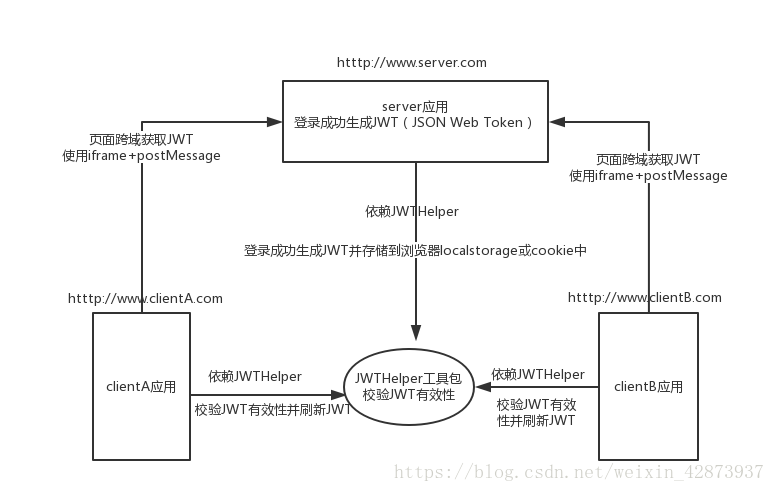
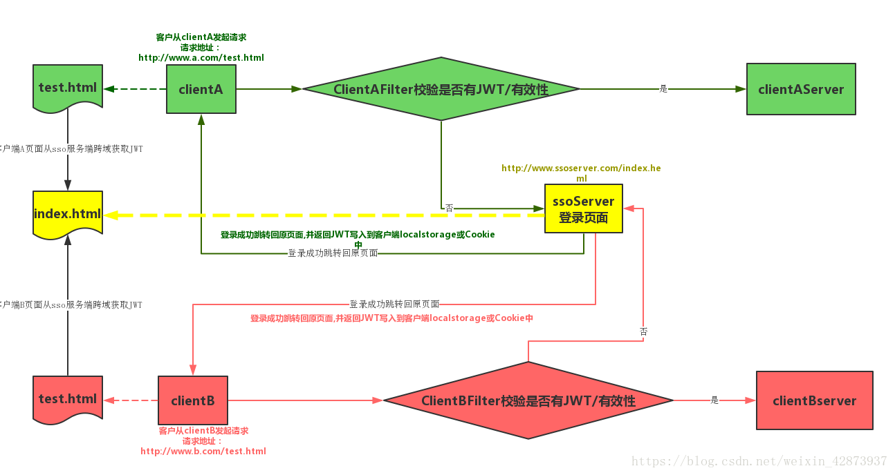
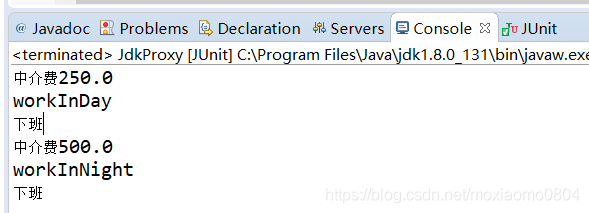

### Review2

一:

@Controller和@Service

@Controller

Controller 主要负责请求转发，接受页面过来的参数，传给Service处理，service接到返回值，再传给页面。

Controller，从字面上理解是***控制器***，所以它是负责***业务调度*** 的，所以在这一层应写一些业务的调度代码。而具体的业务处理应放在service中去写，而且service不单纯是对于dao的增删改查的调用，

@Service

service是***业务层***，所以应该更切近于***具体业务功能***要求，所以在这一层，一个方法所体现的是一个可以***对外***提供的功能。

就是对一个或多个DAO进行的***再次封装***，封装成一个服务，所以这里也就不会是一个原子操作了，需要***事物控制***。(在需要事务支持的地方加入***@Transactional注解***)

> 比如购物商城中的生成订单方法，这里面就不简单是增加个订单记录那么简单，
>
> 我们需要查询库存，核对商品等一系列实际业务逻辑的处理

DAO层(Data Access Object)

DAO层叫数据访问层，属于一种比较底层，比较基础的操作，具体到对于某个表的增删改查，也就是说某个DAO一定是和数据库的某一张表一一对应的，其中封装了增删改查基本操作，建议DAO只做***原子操作，增删改查。***


二:

Java 中sleep()和wait()的区别

- 这两个方法来自不同的类 sleep() 来自***Thread类***. 而wait()  来自***Object类***

  sleep是Thread的***静态类方法***，谁调用的谁去睡觉，即使在a线程里调用了b的sleep方法，实际上还是a去睡觉，要让b线程睡觉要在b的代码中调用sleep。

- 最主要是***sleep***方法***没有释放锁***，而***wait***方法***释放了锁***，使得***其他线程***可以使用同步控制块或者方法。

  sleep不出让系统资源；wait是进入线程等待池等待，出让系统资源，其他线程可以占用CPU。一般wait不会加时间限制，因为如果wait线程的运行资源不够，再出来也没用，要等待其他线程调用notify/notifyAll唤醒等待池中的所有线程，才会进入就绪队列等待OS分配系统资源。sleep(milliseconds)可以用时间指定使它自动唤醒过来，如果时间不到只能调用***interrupt()强行打断***。
  Thread.Sleep(0)的作用是“触发操作系统立刻重新进行一次CPU竞争”

- 使用范围：wait，notify和notifyAll只能在***同步控制方法*** 或者***同步控制块*** 里面使用，而sleep可以在***任何地方***使用

  ```java
  synchronized(x){ 
        x.notify() 
       //或者wait() 
  }
  ```

- sleep必须捕获异常，而wait，notify和notifyAll不需要捕获异常

总结:

- 两者都可以***暂停***线程的执行。

- 对于sleep()方法，我们首先要知道该方法是属于Thread类中的。而wait()方法，则是属于Object类中的。

- Wait 通常被用于***线程间交互/通信***，sleep 通常被用于***暂停执行***。

- sleep()方法导致了程序暂停执行指定的时间，让出cpu该其他线程，但是他的监控状态依然保持者，当指定的时间到了又会自动恢复运行状态。在调用sleep()方法的过程中，线程不会释放对象锁。

- 而当调用wait()方法的时候，线程会放弃对象锁，进入等待此对象的等待锁定池，只有针对此对象调用notify()方法后本线程才进入对象锁定池准备，获取对象锁进入运行状态。线程不会自动苏醒。


三:

死锁问题


四:

Java 用户用户密码加密

https://blog.csdn.net/u013068377/article/details/78921720

- Base64加密算法(编码方式)
- MD5加密(消息摘要算法，验证信息完整性)
- 对称加密算法
- 非对称加密算法
- 数字签名算法
- 数字证书

分类:

1. 按加密算法是否需要key被分为两类： 
   - 不基于key的有: Base64算法、MD5
   - 基于key的有: 对称加密算法、非对称加密算法、数字签名算法、数字证书、HMAC、RC4(对称加密)
2. 按加密算法是否可逆被分为两类： 
   - 单向加密算法(不可解密)：MD5、SHA、HMAC
   - 非单项加密算法(可解密)：BASE64、对称加密算法、非对称加密算法、数字签名算法、数字证书


JWT Oauth2 Shiro

- JWT(JSON Web Token)

  - JWT是一个含***签名***并携带***用户相关信息***的加密串，页面请求校验登录接口时，***请求头***中携带JWT串到***后端服务***，后端通过签名加密串匹配***校验***，保证信息未被篡改。校验通过则认为是可靠的请求，将***正常返回数据***。 

  - 使用情况

    授权: 解决单点登陆问题 服务端不用记录用户状态信息(无状态)

    信息交换: 各个服务之间安全传输信息

  - 结构

    头信息、有效载荷、签名  (xxx.yyy.zzz)

    - header: 头信息

    由两部分组成，***令牌类型***（即：JWT）、***散列算法***（HMAC、RSASSA、RSASSA-PSS等），

    例如：

    ```json
    {
      "alg": "HS256",
      "typ": "JWT"
    }
    ```

    然后，这个JSON被编码为***Base64Url***，形成JWT的第一部分。

    - Playload(有效载荷)

      其中包含***claims***。claims是关于实体（常用的是用户信息）和其他数据的声明，claims有三种类型:

       			**Registered claims：** 这些是一组预定义的claims，非强制性的，但是推荐使用， iss（发行人）， exp（到期时间）， sub（主题）， aud（观众）等；
       			**Public claims:** 自定义claims，注意不要和JWT注册表中属性冲突，[这里可以查看JWT注册表](https://www.iana.org/assignments/jwt/jwt.xhtml)
      			 **Private claims:** 这些是自定义的claims，用于在同意使用这些claims的各方之间共享信息，它们既不是Registered claims，也不是Public claims。

      ```json
      {
        "sub": "1234567890",
        "name": "John Doe",
        "admin": true
      }
      ```

      然后，再经过Base64Url编码，形成JWT的第二部分

    - Signature

      要创建签名部分，必须采用编码的Header，编码的Payload，秘钥，Header中指定的算法，并对其进行签名。

      例如，如果要使用HMAC SHA256算法，将按以下方式创建签名：

      ```JSON
      HMACSHA256(
        base64UrlEncode(header) + "." +
        base64UrlEncode(payload),
        secret)
      ```

- 项目中实际应用

  

  			 

JWT配置

在springboot中的配置

```xml
<!-- JWT验证 -->
<dependency>
    <groupId>io.jsonwebtoken</groupId>
    <artifactId>jjwt</artifactId>
    <version>0.9.0</version>
</dependency>
```

在application.properties文件中自定义

```xml
## JWT
# header:凭证(校验的变量名), expire:有效期1天(单位:s), secret:秘钥(普通字符串)
app.jwt.header=token
app.jwt.expire=5184000
app.jwt.secret=aHR0cHM6Ly9teS5vc2NoaW5hLm5ldC91LzM2ODE4Njg=
```

JWT Bean

```java
package com.gy.fast.common.config.jwt;

import java.util.Date;

import org.slf4j.Logger;
import org.slf4j.LoggerFactory;
import org.springframework.boot.context.properties.ConfigurationProperties;
import org.springframework.stereotype.Component;

import io.jsonwebtoken.Claims;
import io.jsonwebtoken.Jwts;
import io.jsonwebtoken.SignatureAlgorithm;

/**
 * JWT类
 * 
 * @author geYang
 * @date 2018-05-18
 */
@Component
@ConfigurationProperties(prefix = "app.jwt")
public class JWT {
    private Logger logger = LoggerFactory.getLogger(getClass());

    /**
     * 加密秘钥
     */
    private String secret;
    /**
     * 有效时间
     */
    private long expire;
    /**
     * 用户凭证
     */
    private String header;

    /**
     * 获取:加密秘钥
     */
    public String getSecret() {
        return secret;
    }
    
    /**
     * 设置:加密秘钥
     */
    public void setSecret(String secret) {
        this.secret = secret;
    }
    
    /**
     * 获取:有效期(s)
     * */
    public long getExpire() {
        return expire;
    }
    /**
     * 设置:有效期(s)
     * */
    public void setExpire(long expire) {
        this.expire = expire;
    }
    
    /**
     * 获取:凭证
     * */
    public String getHeader() {
        return header;
    }
    /**
     * 设置:凭证
     * */
    public void setHeader(String header) {
        this.header = header;
    }

    /**
     * 生成Token签名
     * @param userId 用户ID
     * @return 签名字符串
     * @author geYang
     * @date 2018-05-18 16:35
     */
    public String generateToken(long userId) {
        System.out.println("header=" + getHeader() + ", expire=" + getExpire() + ", secret=" + getSecret());
        Date nowDate = new Date();
        // 过期时间
        Date expireDate = new Date(nowDate.getTime() + expire * 1000);
        return Jwts.builder().setHeaderParam("typ", "JWT").setSubject(String.valueOf(userId)).setIssuedAt(nowDate)
                .setExpiration(expireDate).signWith(SignatureAlgorithm.HS512, getSecret()).compact();
        // 注意: JDK版本高于1.8, 缺少 javax.xml.bind.DatatypeConverter jar包,编译出错
    }

    /**
     * 获取签名信息
     * @param token
     * @author geYang
     * @date 2018-05-18 16:47
     */
    public Claims getClaimByToken(String token) {
        try {
            return Jwts.parser().setSigningKey(secret).parseClaimsJws(token).getBody();
        } catch (Exception e) {
            logger.debug("validate is token error ", e);
            return null;
        }
    }

    /**
     * 判断Token是否过期
     * @param expiration
     * @return true 过期
     * @author geYang
     * @date 2018-05-18 16:41
     */
    public boolean isTokenExpired(Date expiration) {
        return expiration.before(new Date());
    }

}

```

拦截器

```java
package com.gy.fast.common.config.jwt;

import javax.servlet.http.HttpServletRequest;
import javax.servlet.http.HttpServletResponse;

import org.apache.commons.lang3.StringUtils;
import org.springframework.beans.factory.annotation.Autowired;
import org.springframework.stereotype.Component;
import org.springframework.web.servlet.handler.HandlerInterceptorAdapter;

import com.gy.fast.common.exception.SysException;

import io.jsonwebtoken.Claims;

/**
 * Token验证拦截器
 * @author geYang
 * @date 2018-05-18
 */
@Component
public class JwtInterceptor  extends HandlerInterceptorAdapter {
    
    @Autowired
    private JWT jwt;
    
    public static final String USER_KEY = "userId";
   
    @Override
    public boolean preHandle(HttpServletRequest request, HttpServletResponse response, Object handler)
            throws Exception {
        String servletPath = request.getServletPath();
        System.out.println("ServletPath: " + servletPath);
        // 不需要验证,直接放行
        boolean isNotCheck = isNotCheck(servletPath);
        if (isNotCheck) {
            return true;
        }
        // 需要验证
        String token = getToken(request);
        
        if (StringUtils.isBlank(token)) {
            throw new SysException(jwt.getHeader() + "失效,请重新登录", 401);
        }
        // 获取签名信息
        Claims claims = jwt.getClaimByToken(token);
        System.out.println("TOKEN: " + claims);
        // 判断签名是否存在或过期
        boolean b = claims==null || claims.isEmpty() || jwt.isTokenExpired(claims.getExpiration());
        if (b) {
            throw new SysException(jwt.getHeader() + "失效,请重新登录", 401);
        }
        // 将签名中获取的用户信息放入request中;
        request.setAttribute(USER_KEY, claims.getSubject());
        return true;
    }
    
    /**
     * 根据URL判断当前请求是否不需要校验, true:需要校验
     */
    public boolean isNotCheck(String servletPath) {
        // 若 请求接口 以 / 结尾, 则去掉 /
        servletPath = servletPath.endsWith("/")
                ? servletPath.substring(0,servletPath.lastIndexOf("/"))
                : servletPath;
        System.out.println("servletPath = " + servletPath);
        for (String path : NOT_CHECK_URL) {
            System.out.println("path = " + path);
            // path 以 /** 结尾, servletPath 以 path 前缀开头
            if (path.endsWith("/**")) {
                String pathStart = path.substring(0, path.lastIndexOf("/")+1);
                System.out.println("pathStart = " + pathStart);
                if (servletPath.startsWith(pathStart)) {
                    return true;
                }
                String pathStart2 = path.substring(0, path.lastIndexOf("/"));
                System.out.println("pathStart2 = " + pathStart2);
                if (servletPath.equals(pathStart2)) {
                    return true;
                }
            }
            // servletPath == path
            if (servletPath.equals(path)) {
                return true;
            }
        }
        return false;
    }
    
    /**
     * 获取请求Token
     */
    private String getToken(HttpServletRequest request) {
    	String token = request.getHeader(jwt.getHeader());
    	if (StringUtils.isBlank(token)) {
    		token = request.getParameter(jwt.getHeader());
    	}
    	return token;
    }
    
    /**
     * 不用拦截的页面路径(也可存入数据库中), 不要以 / 结尾
     */
    private static final String[] NOT_CHECK_URL = {"/test/**", "/login/**"}; 

}

```

配置拦截器

```java
package com.gy.fast.common.config;

import com.gy.fast.common.config.jwt.JwtInterceptor;

import org.springframework.beans.factory.annotation.Autowired;
import org.springframework.context.annotation.Configuration;
import org.springframework.http.converter.HttpMessageConverter;
import org.springframework.web.servlet.config.annotation.WebMvcConfigurer;

import java.util.List;

/**
 * WebMvc配置
 * @author geYang
 * @date 2018-05-14
 */
@Configuration
public class WebConfig implements WebMvcConfigurer {
    
    @Autowired
    private JwtInterceptor jwtInterceptor;
    
   /**
    * APP接口拦截器
    * */
    @Override
    public void addInterceptors(InterceptorRegistry registry) {
        registry.addInterceptor(jwtInterceptor).addPathPatterns("/app/**");
    }
  

}

```

基础控制器

```java
package com.gy.fast.module.work.controller;

import javax.servlet.http.HttpServletRequest;

import org.slf4j.Logger;
import org.slf4j.LoggerFactory;

import com.gy.fast.common.config.jwt.JwtInterceptor;
import com.gy.fast.common.util.HttpContextUtils;

/**
 * 基础Controller
 * @author geYang
 * @date 2018-05-15
 */
public abstract class BaseController {
	protected Logger logger = LoggerFactory.getLogger(getClass());

	/**
	 * 获取当前登录用户ID
	 * @author geYang
	 * @date 2018-05-18 19:46
	 */
	protected Long getUserId() {
	    HttpServletRequest request = HttpContextUtils.getHttpServletRequest();
		return Long.parseLong(request.getAttribute(JwtInterceptor.USER_KEY).toString());
	}
}
```

编写用户控制器

```java
package com.gy.fast.module.work.controller.app;

import java.util.HashMap;

import org.springframework.beans.factory.annotation.Autowired;
import org.springframework.web.bind.annotation.GetMapping;
import org.springframework.web.bind.annotation.PostMapping;
import org.springframework.web.bind.annotation.RequestMapping;
import org.springframework.web.bind.annotation.RestController;

import com.gy.fast.common.config.jwt.JWT;
import com.gy.fast.common.util.R;
import com.gy.fast.module.work.controller.BaseController;

/**
 * 用户
 * @author geYang
 * @date 2018-05-18
 */
@RestController
@RequestMapping("app/user")
public class AppUserController extends BaseController{
    
    @Autowired
    private JWT jwt;
    
    /**
     * 获取用户信息
     * @return
     * @author geYang
     * @date 2018-05-18 19:49
     */
    @GetMapping()
    public R info() {
        return R.ok(getUserId());
    }
    
    /**
     * 用户登录
     * @return
     * @author geYang
     * @date 2018-05-18 19:55
     */
    @PostMapping("login")
    public R login() {
       //生成token
        String token = jwt.generateToken(10);
        HashMap<String,Object> map = new HashMap<String,Object>();
        map.put("expire", jwt.getExpire());
        map.put("token", token);
        return R.ok(map);
    }
}
```


```XML
<!--    权限控制的两种方法  只能使用一种-->
<security:global-method-security jsr250-annotations="enabled"></security:global-method-security>
<!--    <sercurity:global-method-security secured-annotations="enabled"></sercurity:global-method-security>-->
<!--    <security:global-method-security pre-post-annotations="enabled"></security:global-method-security>-->
```

jsr250 不是加密方式


五:

AOP底层实现

底层采用了***代理模式***, 分别是

- JDK动态代理 

  必须是***面向接口*** 的 只有实现了具体接口的类才能 生成代理对象

- CGLIB字节码增强

  对于没有实现了接口的类，也可以产生代理，产生***这个类的子类*** 的方式

代理模式(Proxy Pattern):

为其他对象提供一种代理以控制对这个对象的访问。在某些情况下，一个对象***不适合***或者***不能直接***引用另一个对象，而代理对象可以在客户端和目标对象之间起到***中介*** 的作用。

- 优点	

  职责清晰 代理对象 高扩展

- 结构

  一个是真正的要访问的对象(***目标类***) 另一个是***代理对象***

  真正的对象与代理对象实现***同一个接口***

  先访问代理类再访问真正要访问的对象

- JDK动态代理

  Java.lang.reflect.Proxy类可以直接生成一个代理对象

  **Proxy.newProxyInstance():**产生代理类的实例。仅能代理实现至少一个接口的类

  ​    ClassLoader：类加载器。固定写法，和被代理类使用相同的类加载器即可。

  ​    Class[] interface：代理类要实现的接口。固定写法，和被代理类使用相同的接口即可。

  ​    InvocationHandler：策略（方案）设计模式的应用。如何代理？

   

  **InvocationHandler****中的invoke****方法：**调用代理类的任何方法，此方法都会执行  

  ​     Object proxy:代理对象本身的引用。一般用不着。

  ​     Method method:当前调用的方法。

  ​     Object[] args:当前方法用到的参数

目标类接口：

```java
public interface WorkInter {
	void workInDay(double money);
	void workInNight(double money);
}
```

目标类：

```java
public class Worker implements WorkInter{
 
	@Override
	public void workInDay(double money) {
		System.out.println("workInDay");
		
	}
	@Override
	public void workInNight(double money) {
		System.out.println("workInNight");
	}
}
```

代理类：

```java
public class JdkProxy {
	@Test
	public void run() {
		WorkInter proxy = (WorkInter) Proxy.newProxyInstance(Worker.class.getClassLoader(), Worker.class.getInterfaces(), new InvocationHandler() {
			
			@Override
			public Object invoke(Object proxy, Method method, Object[] args) throws Throwable {
 
				System.out.println("中介费"+((double)args[0])/2);
				Object invoke = method.invoke(Worker.class.newInstance(), args);
				
				System.out.println("下班");
				return invoke;
			}
		});
		proxy.workInDay(500);
		proxy.workInNight(1000);
	}
}
```

执行结果:




- CGLIB字节码增强

  核心类：Enhancer

  1. 没有接口，只有实现类。
  2. 采用字节码增强框架 cglib，在运行时 创建目标类的子类，从而对目标类进行增强。

  实现步骤：

  1. 获得代理类的核心类Enhancer对象
  2. 设置父类（目标类），setSuperclass（）方法，底层是创建目标类的子类
  3. 设置回调函数enhancer.setCallback(new MethodInterceptor()) 
  4. 创建代理对象 create()方法

目标类：

```java
public class Worker{
	public void workInDay(double money) {
		System.out.println("workInDay");
		
	}
	public void workInNight(double money) {
		System.out.println("workInNight");
	}
}
```

代理类：

```java
public class WorkerProxy {
	@Test
	public void run() {
			Enhancer enhancer=new Enhancer();
			//2.设置父类（目标类），setSuperclass（）方法，底层是创建目标类的子类
			enhancer.setSuperclass(Worker.class);
			//3.设置回调函数enhancer.setCallback(new MethodInterceptor()) 
			
			enhancer.setCallback(new MethodInterceptor() {
				    *//**
				 * Object object:代理对象
				 * Method method:目标类的方法
				 * Object[] args:方法的形参
				 * MethodProxy methodProxy:方法的代理对象
				 * 
				 *//*
				@Override
				public Object intercept(Object object, Method method, Object[] args, MethodProxy methodProxy) throws Throwable {
					// TODO Auto-generated method stub
					//开启事务
					//前置通知
					
					System.out.println("代理收取费用"+ (double)args[0]/2);
					//执行目标方法，需要目标类实例
					Object invoke = method.invoke(Worker.class.newInstance(), (double)args[0]/2);
					
					//后置通知
					
					System.out.println("go  home~~~~~");
					return invoke;
				}
			});
			
			//4.创建代理对象 create()方法
			Worker workerPeoxy = (Worker) enhancer.create();
			
			workerPeoxy.workInDay(500);
			workerPeoxy.workInNight(1000);
	}
}
```

