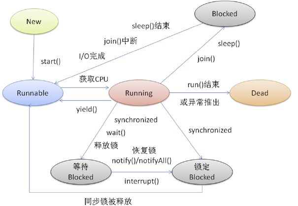
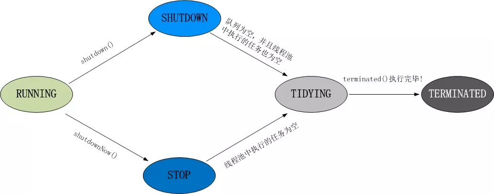
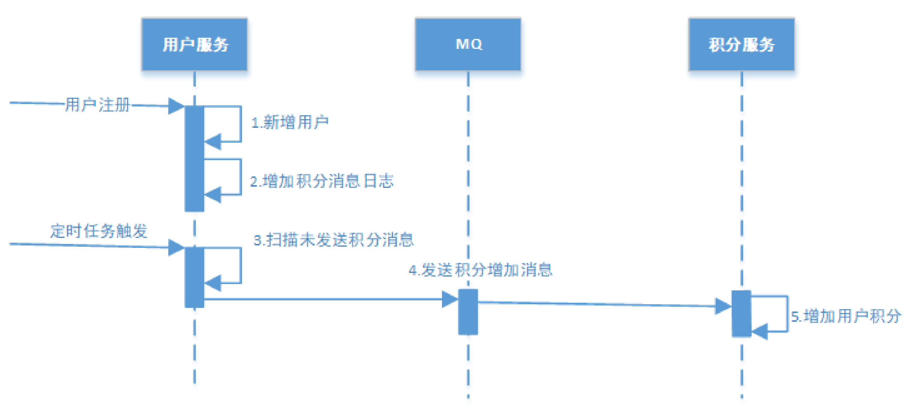
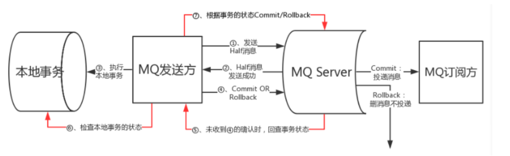

### Thread

**创建线程池有哪几种方式？**

- newFixedThreadPool(int nThreads)

  创建一个***固定长度*** 的线程池，每当提交一个任务就创建一个线程，直到达到线程池的***最大数量***，这时线程规模将不再变化，当线程发生未预期的错误而结束时，线程池会补充一个新的线程。

- newCachedThreadPool()

  创建一个***可缓存*** 的线程池，如果线程池的规模***超过***了处理需求，将***自动回收***空闲线程，而当需求增加时，则可以自动添加新线程，线程池的规模不存在任何限制。

- newSingleTheadExecutor()

  这是一个***单线程*** 的Executor，它创建单个工作线程来执行任务，如果这个线程异常结束，会创建一个新的来替代它；它的特点是能确保依照任务在队列中的顺序来串行执行。

- newScheduledThreadPool(int corePoolSize)

  创建了一个***固定长度***的线程池，而且以***延迟或定时***的方式来执行任务，类似于Timer

##### 线程的状态



##### 线程池的状态

- Running、ShutDown、Stop、Tidying、Terminated
- 

- 线程池中的submit() 和 execute() 方法有什么区别
  - 接收的参数不一样
  - submit有返回值，而execute没有
  - submit方便Exception处理

##### 线程通信

让线程间具有互相发送信号通信的能力

- 利用共享对象实现通信

  通过在某些共享的对象变量中设置一个***信号值*** 。

  线程A在一个synchronize的语句块中设置一个boolean的成员变量hasDataToProcess为true，

  线程B在一个synchronize语句块中读取hasDataToProcess，如果为true就执行代码，否则就等待。

  这样就实现了线程A对线程B的通知。看下面的代码实现：

  ```java
  public class MySignal{
  
    protected boolean hasDataToProcess = false;
  
    public synchronized boolean hasDataToProcess(){
      return this.hasDataToProcess;
    }
  
    public synchronized void setHasDataToProcess(boolean hasData){
      this.hasDataToProcess = hasData;  
    }
  }
  ```

  线程A和B必须拥有同一个MySignal类的对象实例的引用。

  

- 忙等(Busy Waiting)

  线程B执行的条件是，***等待线程A发出通知***，也就是等到线程A将hasDataToProcess()设置为***true***，所以线程B一直在等待信号，线程B处于处于一个忙等的状态。

  > 线程B在等待的过程中是忙碌的，因为线程B在不断的循环检测条件是否成功

  ```java
  protected MySignal sharedSignal = ...
  
  ...
  
  while(!sharedSignal.hasDataToProcess()){
    //do nothing... busy waiting
  }
  ```

  wait(), notify() and notifyAll()

  一个线程可以对任何一个对象调用***wait方法***，这样这个线程就会变成wait状态，***inactive***。

  等待其他线程在同一个对象上调用***notify方法***，来唤醒这个线程

  > 在调用wait和notify方法之前 必须要先获得这个对象的锁，即
  >
  > ! ! !线程必须在synchronize的语句块中调用wait()和notify() 这个是一个必要条件

  ```java
  public class MonitorObject{
  }
  
  public class MyWaitNotify{
  
    MonitorObject myMonitorObject = new MonitorObject();
  
    public void doWait(){
      synchronized(myMonitorObject){
        try{
          myMonitorObject.wait();
        } catch(InterruptedException e){...}
      }
    }
  
    public void doNotify(){
      synchronized(myMonitorObject){
        myMonitorObject.notify();
      }
    }
  }
  ```

  等待的线程可以调用dowait方法，notify线程可以调用donotify方法。

  当一个线程在一个对象上调用notify方法的时候，这个对象的***等待线程队列*** 中的***一个*** 线程会被唤醒，获得执行的权利。

  notifyAll方法则是会将给定对象的***等待队列*** 中的***所有线程*** 都唤醒。

  一个线程如果被唤醒了，***不会立即离开*** wait方法，因为还没获得锁，要等到那个调用notify的线程***离开*** 他的***synchronize*** 的语句块，也就是***等待他释放锁***，才可以获得锁，离开wait。

  > 换句话说，换句话，线程要离开wait方法，必须重新获得锁相应对象的锁。
  >
  > 如果多个线程被notifyall方法唤醒，那么在某一个时刻，只有一个被唤醒的线程可以离开wait方法，因为每个都必须重新获得锁才可以离开wait方法。


- 信号丢失(Missed Singals)

  在调用wait方法等待之前就调用了notify方法, 那么这个notify信号就消失了。可能导致那个等待的线程将一直不会被唤醒

  可以将信号保存起来 利用一个变量

  ```java
  public class MyWaitNotify2{
  
    MonitorObject myMonitorObject = new MonitorObject();
    boolean wasSignalled = false;
  
    public void doWait(){
      synchronized(myMonitorObject){
        if(!wasSignalled){
          try{
            myMonitorObject.wait();
           } catch(InterruptedException e){...}
        }
        //clear signal and continue running.
        wasSignalled = false;
      }
    }
  
    public void doNotify(){
      synchronized(myMonitorObject){
        wasSignalled = true;
        myMonitorObject.notify();
      }
    }
  }
  ```

  利用一个boolean变量就可以解决通知过早的问题

  

- 虚假唤醒(Spurious Wakeups)

  线程在没有调用notify或者notifyAll的时候就被唤醒了

  使用一个自旋锁机制(用while循环代替if循环)

  ```java
  public class MyWaitNotify3{
  
    MonitorObject myMonitorObject = new MonitorObject();
    boolean wasSignalled = false;
  
    public void doWait(){
      synchronized(myMonitorObject){
        while(!wasSignalled){
          try{
            myMonitorObject.wait();
           } catch(InterruptedException e){...}
        }
        //clear signal and continue running.
        wasSignalled = false;
      }
    }
  
    public void doNotify(){
      synchronized(myMonitorObject){
        wasSignalled = true;
        myMonitorObject.notify();
      }
    }
  }
  ```


### Kafka

- 什么是Kafka

  Apache 是一个***发布-订阅*** 开源消息代理应用程序。设计模式主要基于事务日志设计

- Kafka的优点

  高吞吐量 低延迟 容错 耐久性(支持消息复制) 可扩展性

- Kafka中的组件

  Topic: 一堆或者一组消息 

  Producer: 发布通信以及向Kafka主题发布消息 

  Consumer: 定语饿了一个主题 并从主题中读取和处理消息

  Broker: 管理中的消息存储

- 偏移的作用

  唯一的识别分区中的每条消息(顺序递增的)

- Zookeeper 在 Kafka中的作用

  Zookeeper 的主要作用时在集群中的不同结点之间建立协调

- Kafaka的API

  生产者 消费者

- Kafka的message格式是什么样的

  一个Kafka的Message由一个***固定长度的header*** 和一个***变长的消息体body*** 组成

  - header部分由***一个字节***的***magic***(文件格式)和***四个字节的CRC32***(用于判断body消息体是否正常)构成。

    当magic的值为1的时候，会在magic和crc32之间多一个字节的数据：attributes(保存一些相关属性，

    比如是否压缩、压缩格式等等);如果magic的值为0，那么不存在attributes属性

  - body是由N个字节构成的一个消息体，包含了具体的key/value消息。


### 数据库锁

悲观锁，乐观锁，表级锁，行级锁，读锁，写锁，共享锁，排他锁

- 悲观所和乐观锁

  悲观锁 "一锁二查三更新"

  先获取锁(''悲观''的认为这个锁很可能是获取不到的) 再进行业务操作。每次拿数据的时候 都会认为别人会修改，所以每次在那数据的时候都会上锁。别人想拿这个数据就会block知道拿到锁

  oracle 支持select for update no wait (如果拿不到锁直接报错 而不是等待) 而在mysql中没有no wait 

  注意: mysql 在执行select for update的时候 所有的行都会被锁上 一般用悲观锁的时候一般走索引(而不是全表扫描)

  使用场景: 写入频繁 (不适合读取频繁的 因为每次读取都会加上锁 增加开销 降低了吞吐量)

   **悲观锁包括：行锁（包括：共享锁，排他锁），表锁（包括：读锁，写锁）。**

  

  乐观锁

  ***先*** 进行***业务*** 操作 不到万不得已不去拿锁。(“乐观”的认为拿锁多半会是成功的) 

  每次去拿数据的时候都认为别人不会修改，所以不会上锁，但是在***更新*** 的时候会判断一下在此期间别人有没有去更新这个数据，可以使用***版本号*** 等机制。

  适用于***多读*** 的应用类型(可以提高吞吐量)

  **底层机制**: 在数据库内部update同一行的时候是***不允许并发*** 的，即数据库每次执行一条update语句时会获取被update行的***写锁***，直到这一行被成功更新后才释放。

  优点: 

  更加宽松的加锁机制。乐观锁，大多是基于**数据版本（ Version ）**记录机制实现。

  何谓数据版本？即为数据增加一个版本标识，在基于数据库表的版本解决方案中，**一般是通过为数据库表增加一个 数值类型的“version” 字段来实现**。读取出数据时，将此版本号一同读出，之后更新时，对此版本号加一。更新数据时将读出的版本号作为一个条件，如果数据库表中版本号与此版本号相同则能更新成功，否则更新失败。

  缺点:

  来自**外部系统**的更新操作不受我们系统的控制，因此可能会造成**脏数据被更新**到数据库中

  使用场景:

  读取操作比较频繁的场景

- 表级锁

  - 读锁

    LOCK TABLE table_name [ AS alias_name ] READ

  - 写锁

    LOCK TABLE table_name [AS alias_name] [ LOW_PRIORITY ] WRITE

    可以指定优先级 (LOW_PRIORITY,READ,WRITE)

- 行级锁

  行级锁是Mysql中***最细粒度***一种锁，能大大减少数据库操作的冲突，

  但是，由于其粒度最小，加锁的开销最大。行级锁分为***共享锁和排他锁***。

  - 共享锁(SLOCK)

    SELECT ...LOCK IN SHARE MODE;

  - 排他锁(XLOCK)

    SELECT ...LOCK FOR UPDATE;

  行级锁都是基于索引的，如果一条SQL语句用不到索引是不会使用行级锁的，会使用表级锁。行级锁的缺点是：由于需要请求大量的锁资源，所以速度慢，内存消耗大


### 在项目中用到的Redis

博客网站中 有一个module是文章，根据文章的ID从缓存中找出对象用的是Redis。在yml里面用添加redis的host

```
redis:
  host: 192.168.217.130 # 在这里面配置redis
```

此处用redis的作用主要是 减少数据库的压力 避开了与数据库直接交互

```java
/**
	 * 根据ID查询实体
	 * @param id
	 * @return
	 */

	@Autowired
	private RedisTemplate redisTemplate;

	public Article findById(String id) {

		//先从缓存总查询中查询对象 减少数据库压力 避开了与数据库的交互
		Article article = (Article) redisTemplate.opsForValue().get("article_" + id );  //注意get和set

		if(article == null){ //如果没有取到
			//从数据库中取出来
			article = articleDao.findById(id).get();
			//存放到数据库中
			redisTemplate.opsForValue().set("article_" + id, article, 10, TimeUnit.SECONDS); //注意get和set 在有些场景比如 短信验证码的时候 需要设置过期时间10, TimeUnit.SECONDS
		}
		return article;//直接返回article
	}
```

1. 首先试着从Redis缓存中的得到数据(使用get) 
2. 如果得到了就直接返回这个对象
3. 如果没有得到就 直接从数据库中根据ID查找
4. 再把查找出来的数据 存到(使用set) 缓存中 还可以设置过期的时间之类的


### 如何设计一个高可用的系统

****

1. 首先考虑这个系统的性能

   1) 可以将多个服务器组成集群 

   2) 通信的话可以用一个异步

   3) 使用缓存机制提高性能

2. 其次是当这个系统的并发访问量越来越多和数据越来越多时 怎么办

   1) 用负载均衡向集群中添加新的服务器 

3. 减低系统的耦合度

   用一个消息队列进行解耦 通过传递消息进行通信


### 保证分布式系统数据一致性的方案

主要是两种方案

- 本地消息表方案

  最初由ebay 提出的。

  - 通过***本地事务***保证数据业务操作和消息的一致性，(本地数据库操作与记录消息日志操作具备原 子性)

  - 然后 通过***定时任务***不断的进行扫描将消息发送至***消息中间件***，可以启一个独立的线程 因为一直不断的扫描 所以可能会对数据库有一定的影响

  - 待***确认消息***(ack)发送给***消费方***成功将不再向消费者推送消息并将消息删除。

    

- 事务消息方案(RocketMQ方案)

  

​		

​	https://www.bilibili.com/video/BV1FJ411A7mV?p=25


